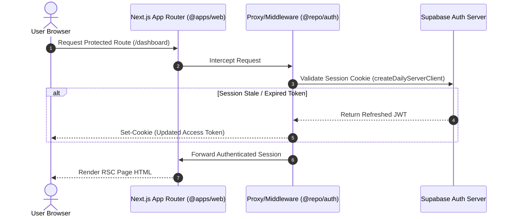
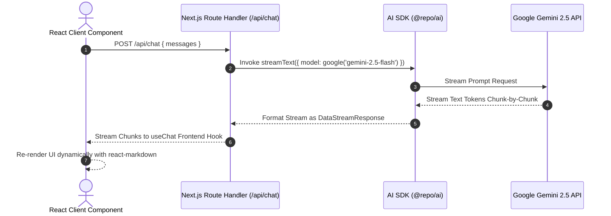

# Architecture: System Data Flow & Sequence Diagrams

## 1. Authentication & Cookie Session Refresh Flow

```mermaid
sequenceDiagram
    autonumber
    actor User as User Browser
    participant App as Next.js App Router (@apps/web)
    participant Proxy as Proxy/Middleware (@repo/auth)
    participant Supabase as Supabase Auth Server

    User->>App: Request Protected Route (/dashboard)
    App->>Proxy: Intercept Request
    Proxy->>Supabase: Validate Session Cookie (createDailyServerClient)
    alt Session Stale / Expired Token
        Supabase-->>Proxy: Return Refreshed JWT
        Proxy-->>User: Set-Cookie (Updated Access Token)
    end
    Proxy->>App: Forward Authenticated Session
    App-->>User: Render RSC Page HTML
```

## 2. LLM Streaming Chat Data Flow

```mermaid
sequenceDiagram
    autonumber
    actor User as React Client Component
    participant Route as Next.js Route Handler (/api/chat)
    participant AI as AI SDK (@repo/ai)
    participant LLM as Google Gemini 2.5 API

    User->>Route: POST /api/chat { messages }
    Route->>AI: Invoke streamText({ model: google('gemini-2.5-flash') })
    AI->>LLM: Stream Prompt Request
    LLM-->>AI: Stream Text Tokens Chunk-by-Chunk
    AI-->>Route: Format Stream as DataStreamResponse
    Route-->>User: Stream Chunks to useChat Frontend Hook
    User-->>User: Re-render UI dynamically with react-markdown
```
