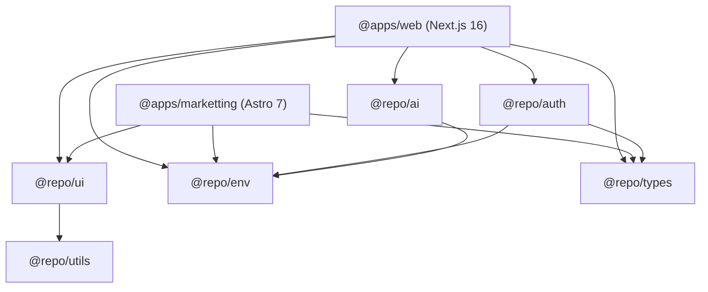

# Architecture: System Overview & Monorepo Topology

## 1. Monorepo Layer Map

```text
turbo-monorepo-template/
├── apps/
│   ├── web/                   # Next.js 16 (App Router, RSC, Supabase, AI SDK) - Name: @apps/web
│   └── marketting/            # Astro 7 (SSG / React Islands) - Name: @apps/marketting
├── packages/
│   ├── ai/                    # Vercel AI SDK wrappers & LLM providers (@repo/ai)
│   ├── auth/                  # Supabase SSR authentication helpers (@repo/auth)
│   ├── env/                   # Type-safe environment validation (@repo/env)
│   ├── eslint-config/         # Shared ESLint presets (@repo/eslint-config)
│   ├── types/                 # Database interfaces & global types (@repo/types)
│   ├── typescript-config/     # Standardized tsconfig bases (@repo/typescript-config)
│   ├── ui/                    # Design system components, CVA & Radix (@repo/ui)
│   └── utils/                 # General helper functions (@repo/utils)
```

## 2. Package Dependency Graph



## 3. Technology Matrix

| Target | Framework | Key Dependencies | Primary Output |
| :--- | :--- | :--- | :--- |
| **`apps/web`** | Next.js 16 (App Router) + React 19 | `@supabase/ssr`, `ai`, `@ai-sdk/react`, `@repo/ui` | Full-stack Web App / SSR / RSC |
| **`apps/marketting`** | Astro 7 SSG + React Islands | `astro`, `@astrojs/react`, `@repo/ui` | Static Marketing Site |
| **`packages/ui`** | React 19 Design System | `class-variance-authority`, `clsx`, `tailwind-merge`, Radix UI | Shared Component Library |
| **`packages/env`** | Zod Environment Validator | `@t3-oss/env-nextjs`, `zod` | Validated Runtime Env Specs |
