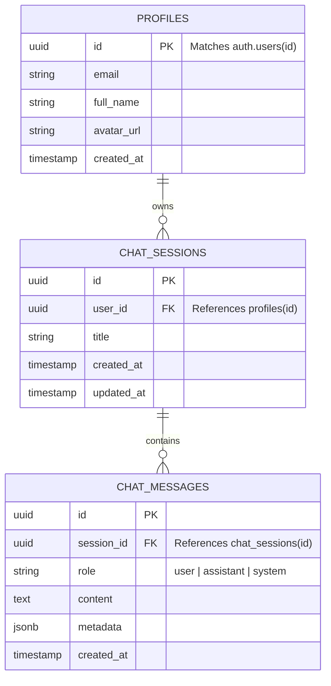

# Database: Entity Relationship Diagram (ERD)

## Postgres Entity Relationships

```mermaid
erDiagram
    PROFILES ||--o{ CHAT_SESSIONS : owns
    CHAT_SESSIONS ||--o{ CHAT_MESSAGES : contains
    
    PROFILES {
        uuid id PK "Matches auth.users(id)"
        string email
        string full_name
        string avatar_url
        timestamp created_at
    }

    CHAT_SESSIONS {
        uuid id PK
        uuid user_id FK "References profiles(id)"
        string title
        timestamp created_at
        timestamp updated_at
    }

    CHAT_MESSAGES {
        uuid id PK
        uuid session_id FK "References chat_sessions(id)"
        string role "user | assistant | system"
        text content
        jsonb metadata
        timestamp created_at
    }
```
